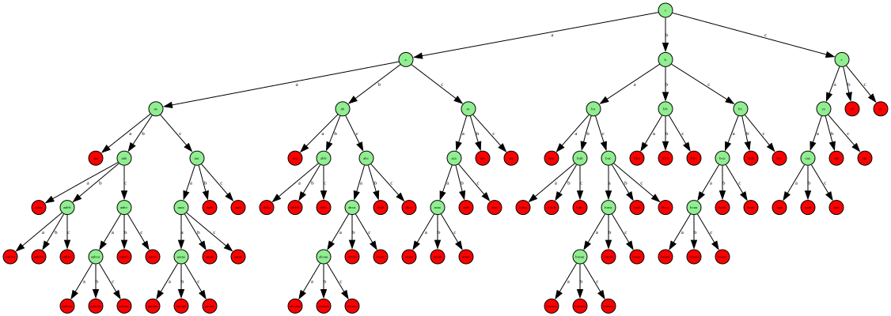

# Лабораторная работа №1

## Задание

По имеющейся SRS определить:

- Завершимость
- конечность классов эквивалентности по НФ. Если их конечное число, то построить минимальную систему переписывания им
  соответствующую.
- локальную конфлюэнтность и пополняемость по Кнуту-Бендиксу

### Начальная SRS

```text
cb -> ba
aaa -> aa
aba -> ba
ac -> cc
baa -> ba
bba -> ba
bbb -> b
bbc -> c
bcc -> cc
ba -> cab
cac -> cc
bab -> cac
ccc -> c
babb -> ba
babc -> ε
baca -> cabba
caab -> bb
caac -> bc
aabcaa -> a
```

---

## 1) Завершимость

Докажем незавершимость исходной SRS. В данном случае существует цикл, который не позволяет в конечном итоге прийти к
нормальной форме.

```text
caba -> (aba -> ba) -> cba -> (cb -> ba) -> baa -> (ba -> cab) -> caba -> ...
```

---

## 2) Конечность

Введем в нашу систему фундированный порядок (армейский), то есть переорентируем правила так, чтобы rule_left >
rule_right (сначала смотрим на длину, потом сравниваем лексиграфически, т.е. c > b > a)

```text
переорентированная система

cb -> ba
aaa -> aa
aba -> ba
cc -> ac
baa -> ba
bba -> ba
bbb -> b
bbc -> c
bcc -> cc
cab -> ba
cac -> cc
cac -> bab
ccc -> c
babb -> ba
babc -> ε
cabba -> baca
caab -> bb
caac -> bc
aabcaa -> a
```

Докажем конечность SRS при помощи построения дерева. Возмем в качестве корневой вершины ε и будем дописывать a|b|c.
Послностью построив дерево можно увидеть, что на границе в итоге остаются только те слова, которые можно переписать (
красные вершины). А так как при переписывании слов новые слова будут либо подниваться выше по дереву, либо оставаться на
то же уровне, то в конечном итоге оно придет к нормальной форме (зеленой вершине). В общей сложности получилось 31
нормальная форма


---

## 3) Локальная конфлюэнтность и пополняемость по Кнуту-Бендиксу

### 3.1) Локальная конфлюэнтность

Докажем что в данной SRS нет локальной конфлюэнтности. Для этого найдем пример, который это доказывает.

Возьмем слово `aabcaaa` и перепишем его:

- по правилу `aabcaa -> a`: `aabcaaa -> aa`
- по правилу `aaa -> aa`: `aabcaaa -> aabcaa`

Переписывая дальше вторую ветку мы получает `aabcaa -> a`. Получается, что две разные ветки переписывания дают нам две
разные НФ `a` и `aa`. Соотвестсвенно система локально не конфлюэнтна.

### 3.2) Пополняемость (с ε-правилом)

Так как в начальной системе существует незамыкаемый цикл, в ней отсутствует пополняемость. Поэтому переопределим правила
в таком же порядке, в каком использовали во пункте 2).

Прогоним нашу систему через программу `rules_additioner.rs`. Получим примерно такую систему:

```text
aaa -> .
bbb -> a
cac -> .
aca -> .
ac -> .
aa -> .
b -> a
ca -> .
c -> .
a -> .
```

Минимизировав полученную систему мы получим:

```text
a -> .
b -> .
c -> .
```

где `.` - это `ε`

### 3.3) Пополняемость (без ε-правила)

Уберем ε-правило из начальной системы и заново прогоним через программу `rules_additioner.rs`. Получим систему:

```text
cb -> a
cc -> c
ac -> c
ab -> a
caa -> a
aa -> a
b -> a
ca -> a
```

Минимизировав полученную систему мы получим:

```text
cc -> c
ac -> c
aa -> a
b -> a
ca -> a
```

### 4) Тестирование

Так как в при пополнении изначальной системы, она становится тривиальной и соответственно инварианты также тривиальны. Поэтому были найдены инварианты на дополненой системе без ε-правила.

## 1. Взвешенная Парих-мера


**Определение:**
$$
(\Phi(w)=\#a+\#b+2\cdot\#c).
$$
Замечание. Это конкретный представитель семейства $$ (\Phi_{(w_a,w_b,w_c)}=w_a\#a+w_b\#b+w_c\#c) \ с \ (w_b\ge w_a) \ и \ (w_c\ge w_b)$$
