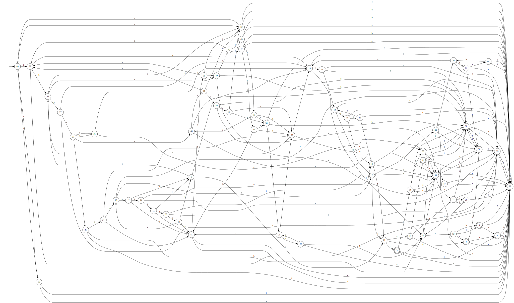
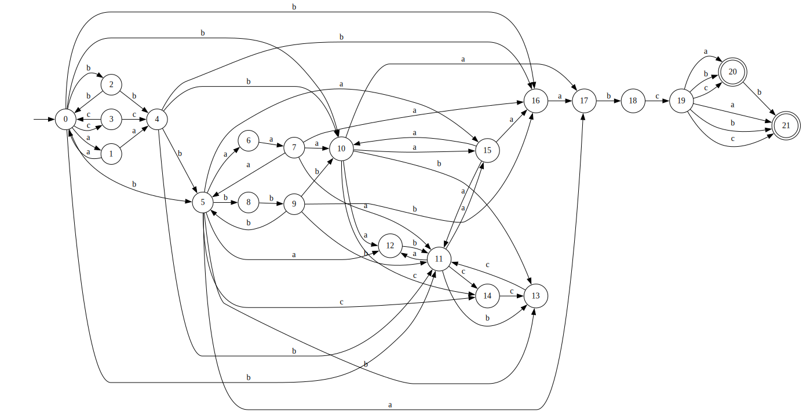
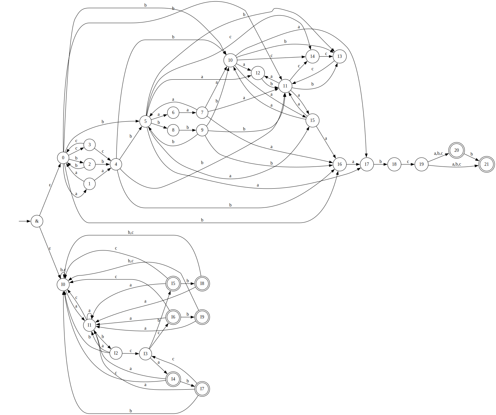

# Лабораторная работа №2

## Регулярное выражение
$`(aa | bb | cc)^*b(aaa | bbb)^*((ab | bc | ccc)^*aa)^*abc(a | b | c)(b | ε)`$

## Задание

По имеющемуся академическому регулярному выражению построить:
- минимальный ДКА, распознающий его язык (минимальность обосновать таблицей классов эквивалентности)
- возможно малый НКА, распознающий его язык. Возможно малый переключающийся (с конъюнкцией) КА, распознающий его язык. Частично обосно- вать таблицами множеств классов эквивалентности.
- расширенное регулярное выражение, распознающее тот же язык.

## DFA

*Автомат был постоен с помощью программы (был реализован алгоритм подмножеств для преобразования и алгоритм Хопкрофта для минимизации)* [перевод из НКА в ДКА](https://github.com/boomhaa/nfa2dfa)

### Таблица эквивалентностей для дка

| prefix\suffix | ε | b | ca | bca | abca | aabca | babca | aaabca | bbabca | cbabca | bbbabca | caaabca | abbbabca | ccaaabca | aabbbabca | aaabbbabca |
|:--------------|:--:|:--:|:--:|:--:|:--:|:--:|:--:|:--:|:--:|:--:|:--:|:--:|:--:|:--:|:--:|:--:|
| ε | - | - | - | - | - | - | + | - | - | - | + | - | - | + | + | - |
| a | - | - | - | - | - | - | - | - | - | - | - | - | + | - | - | + |
| b | - | - | - | - | + | - | - | + | + | - | + | - | - | - | - | + |
| c | - | - | - | - | - | - | - | - | - | + | - | + | - | - | - | - |
| ab | - | - | - | - | - | - | - | - | - | - | - | - | - | - | - | - |
| ba | - | - | - | + | - | + | - | + | - | - | - | - | - | - | + | - |
| bb | - | - | - | - | - | - | + | - | + | - | + | + | - | - | + | - |
| bc | - | - | - | - | - | - | - | - | - | - | - | - | - | + | - | - |
| baa | - | - | - | - | + | + | - | + | - | - | - | - | + | - | - | - |
| bab | - | - | + | - | - | - | - | + | - | - | - | - | - | - | - | - |
| bbb | - | - | - | - | + | - | + | + | + | - | + | - | - | - | - | + |
| bbc | - | - | - | - | - | - | - | + | - | + | - | - | - | - | - | - |
| bcc | - | - | - | - | - | - | - | - | - | - | - | + | - | - | - | - |
| baaa | - | - | - | + | + | + | - | + | - | - | + | - | - | - | - | + |
| baba | - | - | - | - | - | + | - | - | - | - | - | - | - | - | - | - |
| babc | - | + | - | - | - | - | - | - | - | - | - | - | - | + | - | - |
| bbbb | - | - | - | - | + | - | + | + | + | - | + | + | - | - | + | + |
| bbcc | - | - | - | - | - | - | + | - | - | - | + | - | - | + | + | - |
| bccc | - | - | - | - | - | - | - | + | - | - | - | - | - | - | - | - |
| baaaa | - | - | - | + | + | + | - | + | - | - | - | - | - | - | + | - |
| baaab | - | - | + | - | - | - | - | + | + | - | - | + | - | - | - | - |
| baaba | - | - | - | - | - | - | - | - | - | - | - | - | - | - | - | - |
| baabb | - | - | - | - | - | - | - | - | - | - | - | - | - | - | - | - |
| babca | + | + | - | - | - | - | - | - | - | - | - | - | - | - | - | - |
| babbc | - | - | - | - | - | - | - | + | - | - | - | - | - | - | - | - |
| bbabb | - | - | - | - | - | - | - | - | - | - | - | - | - | - | - | - |
| bbabc | - | - | - | - | - | - | - | - | - | - | - | - | - | - | - | - |
| bbaba | - | - | - | - | - | - | - | - | - | - | - | - | - | - | - | - |
| bbbab | - | - | + | - | - | - | - | + | - | - | - | - | - | - | - | - |
| bbbba | - | - | - | + | - | + | - | + | - | - | - | - | + | - | + | + |
| bbbbc | - | - | - | - | - | - | - | + | - | + | - | - | - | + | - | - |
| bbbcc | - | - | - | - | - | - | - | - | - | - | - | + | - | - | - | - |
| bbcca | - | - | - | - | - | - | - | - | - | - | - | - | + | - | - | + |
| bbccc | - | - | - | - | - | - | - | - | - | + | - | + | - | - | - | - |
| bcccc | - | - | - | - | - | - | - | - | - | - | - | - | - | + | - | - |
| baaaab | - | - | + | - | - | - | - | + | - | - | - | + | - | - | - | - |
| baaaba | - | - | - | - | - | + | - | - | - | - | - | - | - | - | - | - |
| baaabb | - | - | - | - | - | - | + | - | - | - | - | + | - | - | - | - |
| baabca | - | - | - | - | - | + | - | - | - | - | - | - | - | - | - | - |
| baabbc | - | - | - | - | - | - | - | - | - | - | - | - | - | - | - | - |
| babcca | - | - | - | - | - | - | - | - | - | - | - | - | - | - | - | - |
| bbabba | - | - | - | - | - | - | - | - | - | - | - | - | - | - | - | - |
| bbabbb | - | - | - | - | - | - | - | - | - | - | - | - | - | - | - | - |
| bbabca | - | - | - | - | - | - | - | - | - | - | - | - | - | - | - | - |
| bbbaab | - | - | - | - | - | - | - | - | - | - | - | + | - | - | - | - |
| bbbcab | - | - | - | - | - | - | - | - | - | - | - | - | - | - | - | - |
| bbbcca | - | - | - | - | - | - | - | - | - | - | - | - | - | - | - | - |
| bbccaa | - | - | - | - | - | - | + | - | - | - | + | - | - | - | + | - |
| bbccab | - | - | - | - | - | - | - | - | - | - | - | - | - | - | - | - |
| bbccca | - | - | - | - | - | - | - | - | - | - | - | - | - | - | - | - |
| bbcccc | - | - | - | - | - | - | + | + | - | - | + | - | - | - | + | - |
| bcccab | - | - | - | - | - | - | - | + | - | - | - | - | - | - | - | - |
| baaabca | + | + | - | - | - | + | - | - | - | - | - | - | - | - | - | - |
| baaabcb | + | + | - | - | - | - | - | - | - | - | - | + | - | - | - | - |
| baabccb | - | - | - | - | - | - | - | - | - | - | - | - | - | - | - | - |
| babccab | - | - | - | - | - | - | - | - | - | - | - | - | - | - | - | - |
| baaabccb | + | - | - | - | - | - | - | - | - | - | - | - | - | - | - | - |
| baaabcab | + | - | - | - | - | - | - | + | - | - | - | - | - | - | - | - |
| baaabccc | - | - | - | - | - | - | - | + | - | - | - | + | - | - | - | - |
| bbbbaaaa | - | - | - | + | + | + | + | + | - | - | + | - | - | - | + | - |
| bbbbaacc | - | - | - | - | - | - | + | - | - | - | + | + | - | - | + | - |
| bbbbcccc | - | - | - | - | - | - | + | + | - | - | + | - | - | + | + | - |
| bbccccaa | - | - | - | - | + | - | + | + | - | - | + | - | - | - | + | - |
| baaabbbbb | - | - | - | - | - | - | + | - | - | - | - | - | - | - | - | - |
| bbbbaaaaa | - | - | - | + | + | + | - | + | - | - | - | - | + | - | - | + |
| bbbbaaaab | - | - | + | - | + | - | - | + | + | - | + | + | - | - | - | + |
| bbbbccccc | - | - | - | - | - | - | - | - | - | + | - | + | - | + | - | - |
| bbccccaaa | - | - | - | + | - | + | - | - | - | - | - | - | + | - | - | + |
| bbbbaaaaaa | - | - | - | + | + | + | + | + | - | - | + | - | - | - | + | + |
| bbbbcccccc | - | - | - | - | - | - | + | + | - | - | + | + | - | - | + | - |
| bbbbaaaaaaa | - | - | - | + | + | + | - | + | - | - | - | - | + | - | + | + |
| bbbbaaaaaaaa | - | - | - | + | + | + | + | + | - | - | + | - | + | - | + | - |

## NFA

### Таблица эквивалентностей для нка (частичная)

| prefix\suffix | babca | abca | aabca | aaabca | b | ε  |
|:--------------|:-----:|:----:|:-----:|:------:|:-:|:--:|
| ε             |   +   |  −   |   −   |   −    | − | −  |
| b             |   −   |  +   |   −   |   +    | − | −  |
| ba            |   −   |  −   |   +   |   +    | − | −  |
| bab           |   −   |  −   |   −   |   +    | − | −  |
| babca         |   −   |  −   |   −   |   −    | + | +  |
| babcab        |   −   |  −   |   −   |   −    | − | +  |

## AFA

### Таблица эквивалентностей для AFA (частичная)

| prefix\suffix | ε | babcab | bbbabcc | aaaabcb | abaaabca | aaaaabca |
| :-------------|:-:| :----: | :-----: | :-----: | :------: | :------: |
| bbb           | - |    +   |    +    |    +    |     +    |     +    |
| b             | - |    -   |    +    |    +    |     +    |     +    |
| baa           | - |    -   |    -    |    +    |     +    |     +    |
| bbc           | - |    -   |    -    |    -    |     +    |     +    |
| ba            | - |    -   |    -    |    +    |     -    |     +    |
| ε             | - |    +   |    +    |    -    |     -    |     -    |

инвариант: все строки, которые принадлежат регулярке, обязательно оканчиваются на один 6 вариантов: abca, abcb, abcc, abcab, abcbb, abccb

## Расширенное регулярное выражение

$`\hat{}(aa|bb|cc)^*b(aaa|bbb)^*((ab|bc|ccc)^*aa)^*abc[abc]b?$`$

Заменил `(b|ε) -> b?`, `(a|b|c) -> [abc]`, добавил `^$` маркеры начала и конца. В данном случае, не имеет смысла еще что-то заменять. Можно конечно сделать $`^* -> ^+?`$, но это не имеет смысла

