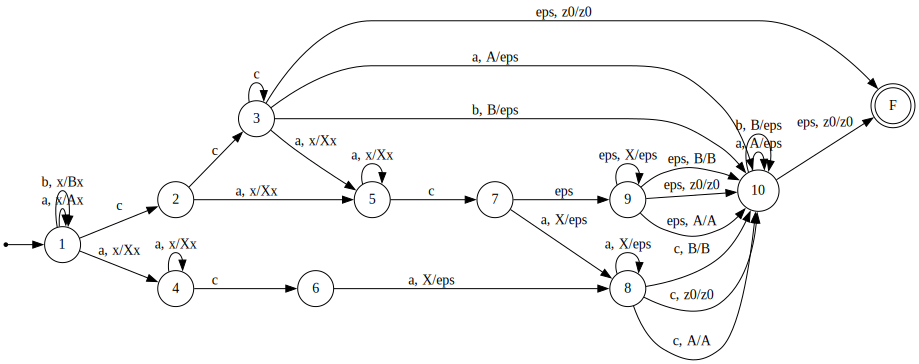

# Лабораторная работа №3

## Язык

```math
\{ wc^i(a^kc)^jw^R \ | \ (j = 2 ∨ (i > 0 \land j = 1)) \land w ∈ \{a,b\}^* \}
```

## Задание

- Проанализировать язык на детерминизм. Построить PDA: в случае детерминированного языка построить DPDA, в случае недетерминированного
  языка — PDA без избыточного недетерминизма (для каждого недетерминированного перехода привести пример слов с общим длинным префиксом,
  в которых на переходе существенно отличается поведение стека).
- Проанализировать язык на беспрефиксность.
- Построить КС-грамматику для языка, если таковой нет. Пересечь её с регулярными аппроксимациями сверху, полученными использованием First, Follow множеств («LL(1)-автомат»), и позиционного автомата («LR(0)-автомат»).
- Провести автоматическое тестирование предполагаемой эквивалентности построенных распознавателей (до и после пересечения с регулярным приближением)

## PDA

\

Рассмотрим недетерменированные переходы:

1. Недетерменированность в состоянии `1`: `1->1 (a, x/Ax)` или `1->4 (a, x/Xx)`
Два слова:
    - $`w_1 \ = \ a^na^nca^nca^n \ (i=0, j=2, w=a^n, k=n)`$
    - $`w_2 \ = \ a^{n+1}a^nca^nca^{n+1} \ (i=0, j=2, w=a^{n+1}, k=n)`$ 

    Общий префикс: $`p=a^n`$

    Пояснение расхождения стека:
    После чтения $`p=a^n`$ стек содержит $`A^nz_0`$, следующий символ - `a`:
    - Для $`w_1`$ - это начало нового блока $`a^k`$ => нужен переход `1->4`
    - Для $`w_2`$ - это продолжение подслова $`w`$ => нужен переход `1->1`

2. Недетерменированность в состоянии `3`: `3->5 (a, x/Xx)` или `3->10 (a, A/eps)`
    - $`w_1 \ = \ a^ncca^n \ (i=0, j=2, w=a^n, k=0)`$
    - $`w_2 \ = \ a^ncca^nca^n \ (i=2, j=1, w=a^n, k=n)`$ 

    Общий префикс: $`p=a^ncc`$

    Пояснение расхождения стека:
    После чтения $`p=a^n`$ стек содержит $`A^nz_0`$, следующий символ - `a`:
    - Для $`w_1`$ - это первый символ $`w^R`$ => нужен переход `3->10`
    - Для $`w_2`$ - это начало блока $`a^k`$ => нужен переход `3->5
    `
3. Недетерменированность в состоянии `7`: `7->9 (eps)` или `7->8 (a, X/eps)`
    - $`w_1 \ = \ a^mca^nca^m \ (i=1, j=1, w=a^m, k=0)`$
    - $`w_2 \ = \ a^mca^nca^nca^m \ (i=1, j=2, w=a^m, k=n)`$ 

    Общий префикс: $`p=a^mca^nc`$

    Пояснение расхождения стека:
    После чтения $`p=a^n`$ стек содержит $`A^nz_0`$, следующий символ - `a`:
    - Для $`w_1`$ - второго блока $`(a^kc)`$ нет => нужен переход `7->9`, чтобы снять все `X` по `eps` и перейти к считыванию $`w^R`$
    - Для $`w_2`$ - второй блок $`(a^kc)`$ есть => нужен переход `7->8`

## Беспрефиксность
Язык не является беспрефиксным. Рассмотрим два слова:
- $`w=ε, i=0, j=2, k=0`$. Тогда строка будет выглядеть как $`x="сс"`$.
- $`w=ε, i=1, j=2, k=0`$. Тогда строка будет выглядеть как $`y="ссс"`$.

Видим, что $`y=xc`$.

## LL-свойство

Так как LL-свойство требует детерминированности, соответственно язык не обладает LL-свойством.

## КС-грамматика

Построим для нашего языка КС-грамматику:

```math
S -> a S a \ | \ b S b \ | \ M
\newline
M -> U \ | \ V
\newline
U -> C0 D c
\newline
V -> c C0 A c
\newline
C0 -> c C0 \ | \ eps
\newline
A -> a A \ | \ eps
\newline
D -> a D a \ | \ c
```

## Аппроксимация

### LL(1)-аппроксимация

Линеаризуем КС-грамматику:

```math
S -> a_1 S a_2 \ | \ b_3 S b_4 \ | \ M
\newline
M -> U \ | \ V
\newline
U -> C0 D c_5
\newline
V -> c_6 C0 A c_7
\newline
C0 -> c_8 C0 \ | \ eps
\newline
A -> a_9 A \ | \ eps
\newline
D -> a_{10} D a_{11} \ | \ c_{12}
```

Построим для полученной грамматики FIRST(L(G)), LAST(L(G)), FOLLOW(L(G)) множества:

```math
FIRST(L(G)) \ = \{a_1, \ b_3, \ c_6, \ c_8, \ a_{10}, \ c_{12} \}
```

```math
LAST(L(G)) \ = \ \{a_2, \ b_4, \ c_5, \ c_7 \}
```

```math
FIRST(L(G)) \ = \ \{
  a_1a_1, \ a_1b_3, \ a_1c_6, \ a_1c_8, \ a_1a_{10}, \ a_1c_{12},
\newline
  b_3a_1, \ b_3b_3, \ b_3c_6, \ b_3c_8, \ b_3a_{10},\  b_3c_{12},
\newline
  a_2a_2, \ a_2b_4, \ b_4a_2, \ b_4b_4,
\newline
  c_5a_2, \ c_5b_4, \ c_7a_2, \ c_7b_4,
\newline
  c_8c_8, \ c_8a_{10}, \ c_8c_{12}, \ a_{11}c_5, \ c_{12}c_5,
\newline
  c_6c_8, \ c_6a_9, \ c_6c_7, \ 
  c_8a_9, \ c_8c_7, \ a_9a_9, \ a_9c_7,
\newline
  a_{10}a_{10}, \ a_{10}c_{12}, \ a_{11}a_{11}, \ c_{12}a_{11}
\}
```

#### LL(1) автомат

-approx.svg)

### LR(0)-аппроксимация

#### Позиционный автомат

-automaton.png)

#### LR(0)-аппроксимация

-approx.svg)

## Пересечение аппроксимаций с грамматикой

Чтобы пересечь нашу грамматику с регулярными аппроксимациями, перепишем ее в `НФХ`:

```math
S  -> A1 X1
\newline
S  -> B1 X2
\newline
S  -> C0 X3
\newline
S  -> D C1
\newline
S  -> C1 X4
\newline
S  -> C1 X6
\newline
S  -> C1 X7
\newline
S  -> C1 C1
\newline
X1 -> S A1
\newline
X2 -> S B1
\newline
X3 -> D C1
\newline
X4 -> C0 X5
\newline
X5 -> A C1
\newline
X6 -> A C1
\newline
X7 -> C0 C1
\newline
C0 -> C1 C0
\newline
C0 -> c
\newline
A  -> A1 A
\newline
A  -> a
\newline
D  -> A1 X8
\newline
D  -> c
\newline
X8 -> D A1
\newline
A1 -> a
\newline
B1 -> b
\newline
C1 -> c
```

Пересечения были выполнены программно и лежат в файлах [intersection_grammar_lr0](grammars/intersections/lr_approx_inter.cfg) и [intersection_grammar_ll1](grammars/intersections/ll_approx_inter.cfg)

## Фаззинг

Для проверки принадлежит ли слово КСГ используется `алгоритм Эрли`. Фаззер лежит в файле [fuzzer](src/fuzzer.rs)