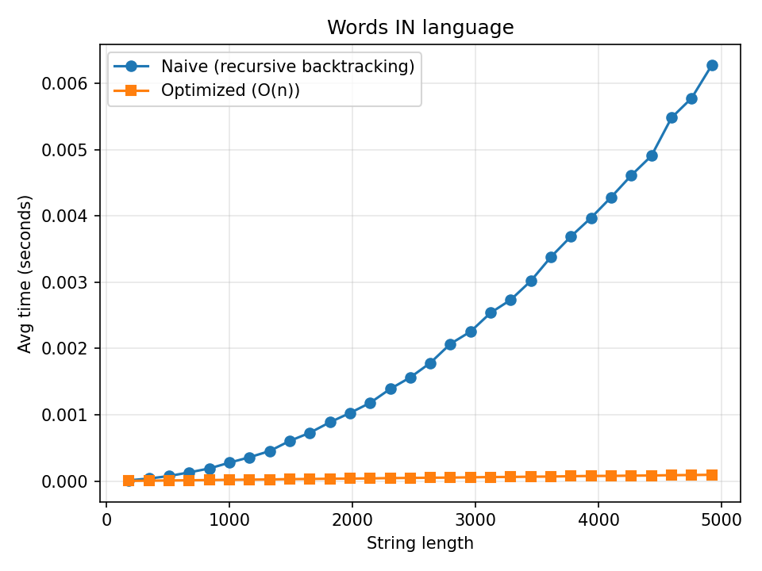
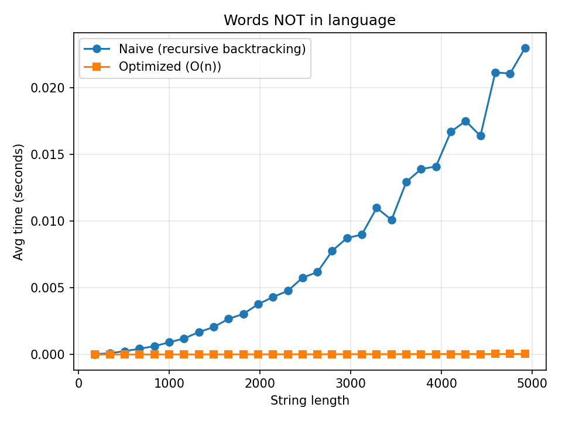

# Лабораторная работа №4

## Регулярное выражение

$`\hat\ ((?:a|b)^∗)c((?:a|b)^∗)(?=\backslash1ab\backslash2)\backslash2ba\backslash1$`$

## Задание

- Проанализировать язык на КС-свойство, в случае его наличия — на регулярность.
- Построить "наивный"парсер слов для языка, используя рекурсивный разбор с возвратами. Парсер не должен зацикливаться.
- Построить оптимизированный парсер слов для языка. Оценить сверху его вычислительную сложность.
- Посредством фазз-тестирования проверить эквивалентность парсеров и построить сравнительные графики скорости их работы на случайных словах, принадлежащих языку, и не принадлежащих языку (два тестовых пула).

## КС-свойство

Пересесчем наш язык с регулярным языком $` R = a^+ba^+c(aa)^+baa^+ba^+`$. Получим язык $` L\ \cap \ R = L' `$, где $` L' = \{a^nba^nca^{2n}baa^nba^n \ | \ n \geq 1 \}`$
Рассмотрим язык `L'` на КС-свойство. Если язык КС, то существует `p`, что можно взять любую строку $`w \ \in L'`$ длины $`\geq p`$ можно разложить 
```math
w = uvxyz
```

так, что:
1. $`|vxy| \leq p`$
2. $`|vy| \geq 1`$
3. $`\forall t \geq 0:uv^txy^tz \in L'`$

Рассмотрим строку из `L'` при $`n = p`$:

```math
w = a^pba^aca^{2p}baa^pba^p
```

Обозначим разные блоки степени `a` разными символами:
```math
\underbrace{a^{p}}_{A_1}\;
b\
\underbrace{a^{p}}_{A_2}\;
c\,
\underbrace{a^{2p}}_{A_3}\;
ba\
\underbrace{a^{p}}_{A_4}\;
b\
\underbrace{a^{p}}_{A_5}.
```

Так как $`|vxy| \leq p`$, подслово `vxy` не может покрыть сразу два разных маркера из $`\{b, c, b, a, b\}`$, поэтому возможны два случая разбиения:
1. Подслово `vxy` содержит один из одиночных симоволов (символа со степенью 1). Тогда при накачке $`t=0`$ подслова `v` и `y` стираются и исчезает один из маркеров, что повлечет за собой нарушение структуры слова, и поэтому оно не будет принадлежать `L'`
2. Подслово `vxy` полностью лежит в одном из блоков $`{A_1}, {A_2}, {A_3}, {A_4}, {A_5}`$. Тогда при $`t=0`$ длина одного из блоков $`{A_i}`$, а длина других останется неизменной, что опять же нарушит структуру слова, так как по умолчанию длина каждого блока $`{A_i}`$ зависит от `n` (конкретно длины блоков $`{A_1}, {A_2}, {A_4}, {A_5}`$ равны `n`, а длина блока $`{A_3}`$ равна `2n`), но после накачки длина одного из блоков уже не будет зависеть от `n`.

Во обоих случаях нашлось $`t=0:uv^txy^tz \notin L'`$. Таким образом язык `L'` не является КС. А так как КС языки замкнуты относительно пересечения с регулярными, то начальный язык `L` также не явзяется КС языком

## "Наивный" парсер

"Наивный" парсер находится в файле [src/fuzzer.rs](src/fuzzer.rs) в методе `naive_parser`.

## Оптимизированный парсер

Оптимизированный парсер находится в файле  [src/fuzzer.rs](src/fuzzer.rs) в методе `optimize_parser`.
Сложность оптимизированного парсера составляет `O(n)`, где `n` — длина входного слова.

## Фазз-тестирование

Код фазз-тестрования находится в файле [src/fuzzer.rs](src/fuzzer.rs). Были построены графики сравнения скорости работы парсеров на словах, принадлежащих языку и не принадлежащих языку.




