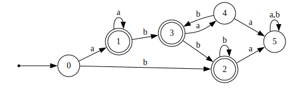
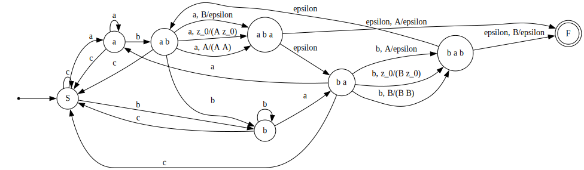

# Теория формальных языков — Рубежный контроль №1
**Вариант №22**  
**Тараканов Влад ИУ9-52Б**

---

## Задание 1

Язык контекстно-свободных грамматик, порождающих языки — подмножества $(ab)^*$.  
Слова языка могут включать нетерминалы `S` (где `S` — стартовый), `A`, символ `->`, терминалы `a`, `b` и разделитель `;`.

### Решение

Предположим, что язык регулярен. Тогда должна существовать константа накачки $p>0$. Рассмотрим строку

$$
\omega = S \to aA;\ A \to bS;\ S \to ab;
$$

которая является корректным описанием исходной грамматики. Строка $\omega$ порождает язык $(ab)^+$, который является подмножеством $(ab)^*$.

Разобьём $\omega$ на части $x$, $y$, $z$ так, чтобы $|xy|\le p$, $|y|>0$, и для любого $i\ge 0$ строка $xy^iz$ принадлежала языку. Выберем разбиение:

- $x$ = `S ->`
- $y$ = `a`
- $z$ = `A;A -> bS;S -> ab;`

Тогда $|xy| = |S \to a| = 3 \le p$ (при $p\ge 3$), $|y|=1>0$. Условие леммы должно выполняться для всех $i$, однако:

- При $i=0$ получаем строку  
  $xz =$ `S -> A;A -> bS;S -> ab;`.  
  Эта грамматика порождает, например, строку `bbab`, которая не принадлежит исходному языку. Следовательно, $xz$ не принадлежит данному языку.

- При $i=2$ получаем строку  
  $xy^2z =$ `S -> aaA;A -> bS;S -> ab;`.  
  Эта грамматика порождает, например, строку `aabab`, которая не принадлежит исходному языку. Следовательно, $xy^2z$ не принадлежит данному языку.

Таким образом, для $i=0$ и $i=2$ строки $xy^iz$ не принадлежат исходному языку, что противоречит лемме о накачке. Следовательно, предположение о регулярности языка неверно.

---

## Задание 2

Язык
```math
\{\, a^*\,\omega\, b^* \mid |\omega|_{abab} = |\omega|_{ba}\ \land\ \omega \in \{a,b\}^+ \,\}.
```

### Решение


---

## Задание 3

Язык слов, в котором число подстрок `aba` и число подстрок `bab` **не совпадают**. Алфавит $\{a,b,c\}$.

### Решение

Докажем, что язык $L$ не является регулярным. Рассмотрим язык

```math
\overline{L} = \{\, \omega \mid |\omega|_{aba} = |\omega|_{bab}\ \land\ \omega \in \{a,b,c\}^* \,\}.
```

Если $\overline{L}$ является регулярным, то $L$ также должен быть регулярным.

Построим таблицу конкатенаций для языка $\overline{L}$:

|   | $a$ | $aaba$ | $aabaab a$ | $\dots$ | $a(aba)^k$ | $a(aba)^{k+1}$ |
|---|---:|---:|---:|---:|---:|---:|
| $bab$ | $+$ | $-$ | $-$ | $\dots$ | $-$ | $-$ |
| $babbab$ | $-$ | $+$ | $-$ | $\dots$ | $-$ | $-$ |
| $\dots$ | $\dots$ | $\dots$ | $\dots$ | $\dots$ | $\dots$ | $\dots$ |
| $(bab)^{k+1}$ | $-$ | $-$ | $-$ | $\dots$ | $+$ | $-$ |

Видим, что все префиксы различимы, значит $\overline{L}$ не регулярен, следовательно, $L$ также не регулярен.

Построим для $L$ следующий PDA


